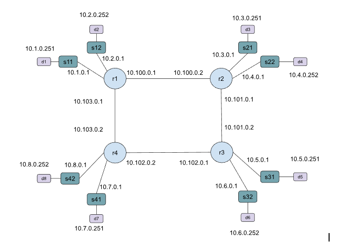

# 4 Router OSPF Topology

We have a topology with 4 routers, 8 switches, and 8 hosts.
One OSPF Area. We use OSPF for connectivity.

## Notes

Router configs are in r1/frr.conf, r2/frr.conf, r3/frr.conf, r4/frr.conf

- Is it possible to use a loopback address as the OSPF router id?
- Should we add IPv6 addresses and OSPFv3?

