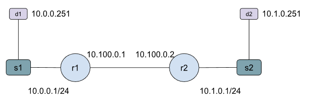

# Two Router Topology

We have a topology with 2 routers, 2 switches, and 2 hosts and use static
routes on the routers to get reachability.

In order to reach host d2, router r1 needs the next hop for the 10.1.0.0/24 subnet.

In order to reach host d1, router r2 needs the next hop for the 10.0.00/24 subnet.

We have two examples:
- mn_topy.py: Uses FRR with configured static routes.
- mn_no_frr.py: Uses ip route to directly configure routes without FRR

